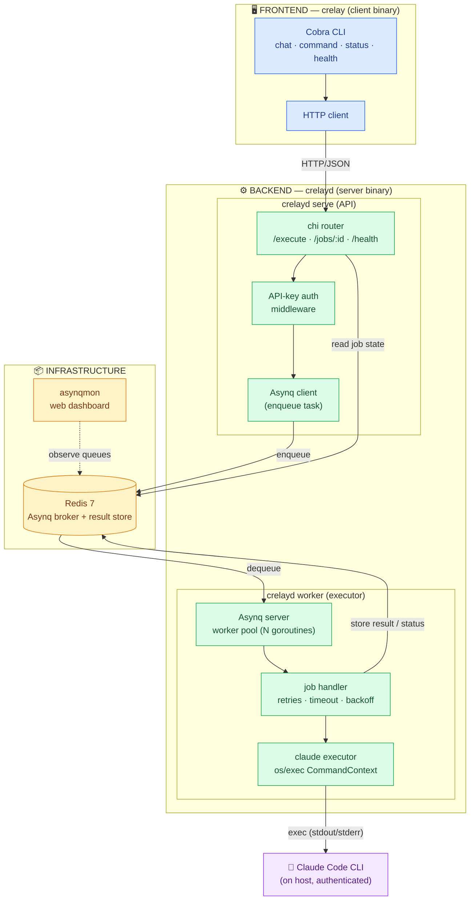
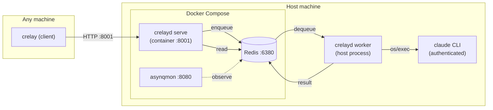
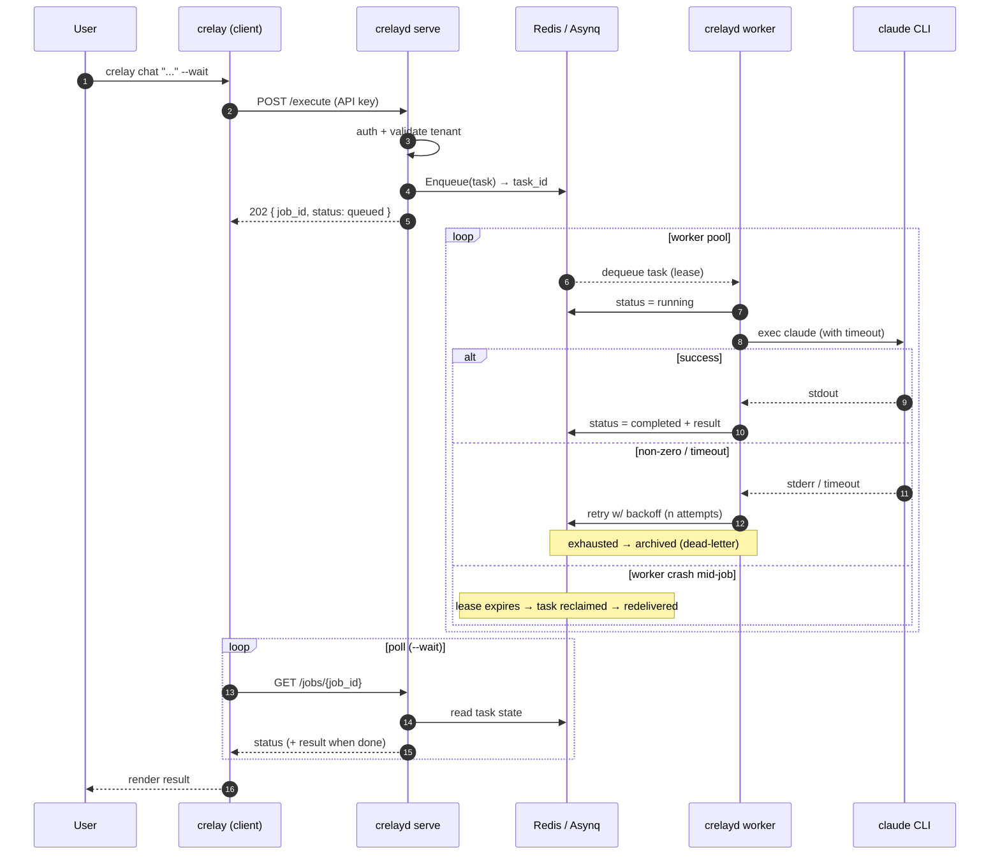

# crelay — Architecture (Proposed)

> **crelay** (*Claude + relay*) is a clean-room Go rewrite of CCRS, keeping the
> original idea and hybrid architecture. It relays a request to the Claude Code
> CLI and returns the result. The flimsy hand-rolled `LPUSH`/`BRPOP` queue is
> replaced with a real job queue (**Asynq**), and the Python client + Bash
> wrapper + two workers collapse into **two Go binaries**: `crelay` (client) and
> `crelayd` (server).

## Naming

**crelay** — pronounced *cre-lay* (a blend of **Cl**aude + **relay**, spoken as one word).

- **crelay** — the client binary (frontend / interaction). `crelay chat "..."`
- **crelayd** — the server daemon (backend). `crelayd serve`, `crelayd worker`

(Formerly *CCRS — Claude Code Routing Service*. Renamed during the rewrite:
"routing" was inaccurate — the service **queues and relays** work to Claude, it
doesn't route between destinations.)

## Target Stack

| Concern | Python (CCRS, today) | Go (crelay, proposed) |
|---|---|---|
| Client / CLI | Bash wrapper + `ccrs.bat` + `cli.py` (Click) | **`crelay`** binary — [Cobra](https://github.com/spf13/cobra) |
| API server | `app.py` (FastAPI) | **`crelayd serve`** — `net/http` + [chi](https://github.com/go-chi/chi) |
| Worker | `worker.py` + `worker-production.py` | **`crelayd worker`** — [Asynq](https://github.com/hibiken/asynq) handler |
| Queue | Redis `LPUSH`/`BRPOP` (at-most-once) | **Asynq over Redis** (at-least-once, retries, DLQ, reclaim) |
| Job store | JSON blobs in Redis | Asynq task state + result store in Redis |
| Claude exec | `subprocess.run` | `os/exec` `CommandContext` |
| Logging | `print()` | `log/slog` (structured) |
| Config | env vars | env + flags (Cobra/Viper) |
| Observability | none | **asynqmon** dashboard |
| Tests | pytest + fakeredis + httpx | `testing` + `miniredis` + `httptest` |

## Component Architecture



## Deployment Topology (Hybrid — unchanged idea)

The worker stays on the **host** for authenticated `claude` CLI access; API + Redis
stay **containerized**. The client runs anywhere.



## Job Lifecycle (at-least-once with retries)



## Proposed Module Layout

```
crelay/
├── go.mod                  # module github.com/vedanta/crelay
├── cmd/
│   ├── crelay/        # client binary (frontend)
│   │   └── main.go    # Cobra root: chat/command/status/health
│   └── crelayd/       # server binary (backend)
│       └── main.go    # Cobra root: serve / worker
├── internal/
│   ├── api/           # chi handlers, request/response models, auth middleware
│   ├── worker/        # Asynq handler + claude executor
│   ├── queue/         # Asynq client/server wiring, task payloads
│   ├── job/           # shared job types (wire contract client↔server)
│   ├── claude/        # os/exec wrapper around the claude CLI
│   └── config/        # env + flag loading
├── deploy/
│   ├── docker-compose.yml
│   └── Dockerfile
└── ARCHITECTURE-GO.md
```

**Key shift from Python:** `internal/job` is the single source of truth for the
wire contract, imported by both `crelay` (client) and `crelayd` (server) — no more
drift between `models.py` and the CLI's hand-built dicts.

## What Carries Over vs. Changes

**Kept (the good bones):**
- Hybrid deploy — worker on host for authenticated Claude access
- Redis as the backing store / broker
- Tenant-scoped jobs, async submit + poll lifecycle
- `chat` / `command` operations

**Changed (the maturity gaps):**
- Reliable queue (Asynq) → retries, dead-letter, crash reclaim, worker pool
- One client binary + one server binary (was: Bash + bat + cli.py + 2 workers)
- API-key auth + tightened CORS
- Structured logging (`slog`) + queue dashboard (asynqmon)
- Single typed wire contract shared by client and server

---

**Status:** proposal for review. Nothing implemented yet — this documents the
target before writing Go.

> **Note:** the git repo itself is still named `ccrs`. Renaming the GitHub repo
> to `crelay` (and the local dir + module path) is a separate step to do when we
> start the actual rewrite.
