# 🏗️ CCRS Architecture Guide

**Detailed system design and technical architecture**

## 🎯 Architecture Overview

CCRS follows a **hybrid microservice architecture** that combines the reliability of containerized infrastructure with the flexibility of host-based processing for Claude CLI integration.

### High-Level System Architecture

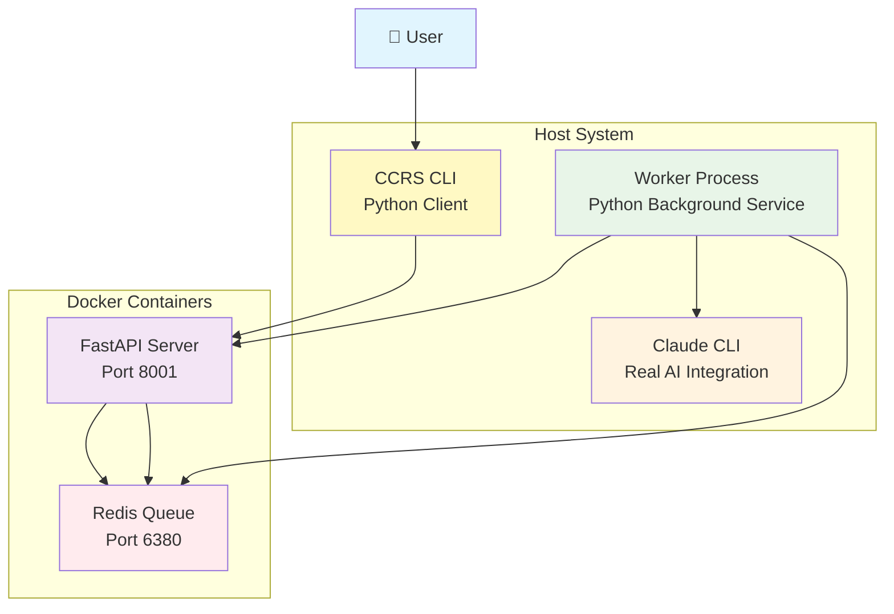

### Job Processing Flow

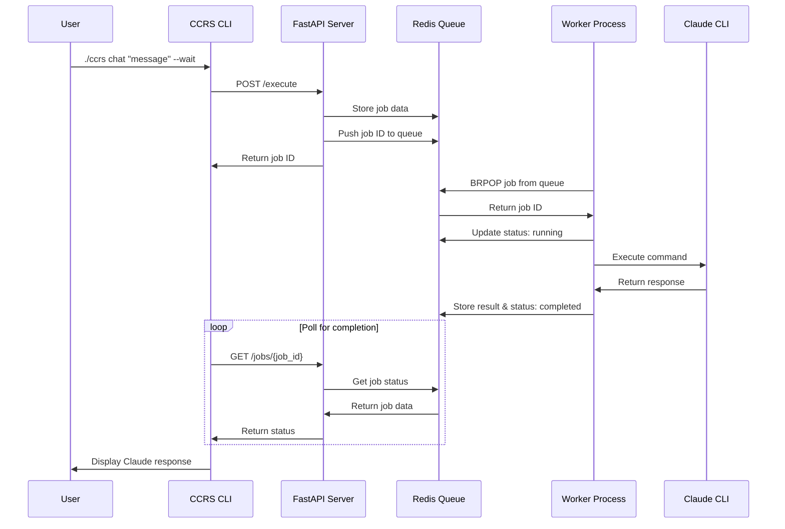

## 🧩 Core Components

### 1. CCRS CLI (Client)
**File:** `cli.py`
**Purpose:** User interface and API client

**Responsibilities:**
- Command-line interface for user interactions
- HTTP client for API communication
- Job submission and status polling
- Result formatting and display

**Key Features:**
- Click-based command structure
- Automatic job polling with `--wait`
- Multi-tenant support
- Environment variable configuration

### 2. FastAPI Server (API)
**File:** `app.py`
**Container:** `ccrs-api`

**Responsibilities:**
- REST API endpoints
- Job validation and queuing
- Health checks and monitoring
- Multi-tenant job isolation

**Key Endpoints:**
```python
GET  /              # Service info
GET  /health        # Health check
POST /execute       # Submit job
GET  /jobs/{job_id} # Job status
```

**Architecture Pattern:**
- Stateless request handling
- Redis-backed job storage
- Pydantic model validation
- FastAPI automatic documentation

### 3. Redis Queue (Storage)
**Container:** `ccrs-redis`
**Port:** `6380` (host) → `6379` (container)

**Responsibilities:**
- Job queue management
- Result storage and caching
- Multi-tenant data isolation
- Persistent job history

**Data Structures:**
```redis
# Job Queue
ccrs:job_queue → List of job IDs

# Job Storage
job:{job_id} → JSON job data with status/result

# Example:
job:ccrs-abc123 → {
  "job_id": "ccrs-abc123",
  "tenant_id": "demo",
  "operation": "chat",
  "message": "Hello Claude!",
  "status": "completed",
  "result": "Hello! How can I help?",
  "created_at": "2024-01-25T10:00:00Z",
  "completed_at": "2024-01-25T10:00:05Z"
}
```

### 4. Worker Process (Processor)
**File:** `worker.py`
**Location:** Host system

**Responsibilities:**
- Job queue consumption
- Claude CLI execution
- Result processing and storage
- Error handling and recovery

**Architecture Pattern:**
- Blocking queue consumer (`brpop`)
- Direct Claude CLI subprocess execution
- Graceful error handling
- Automatic reconnection on failures

## 🔄 Data Flow & Job Lifecycle

### Component Interaction Diagram

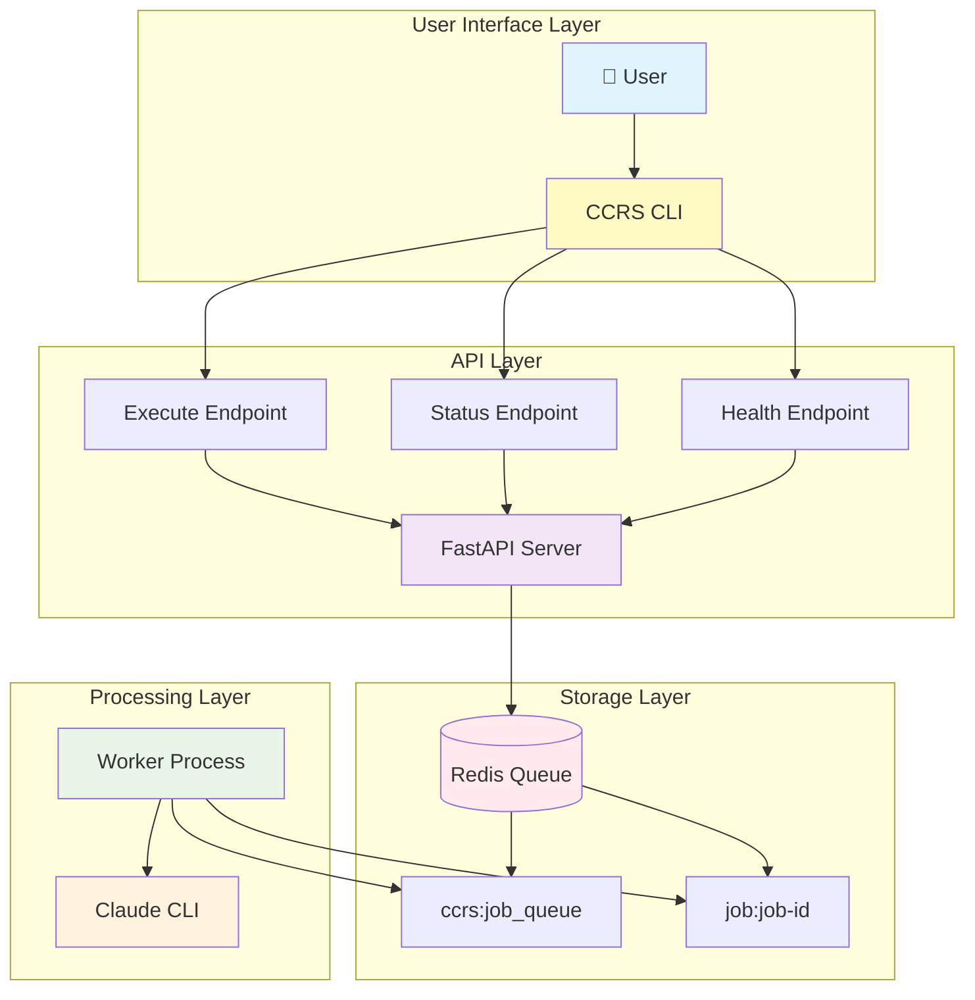

### Job State Machine

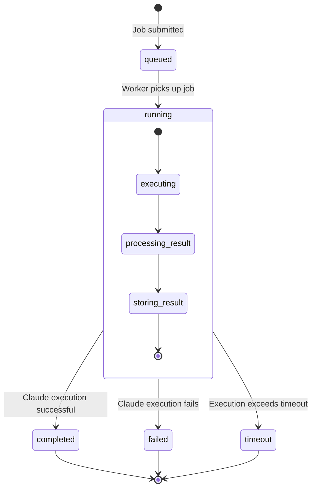

### Detailed Job Processing Flow

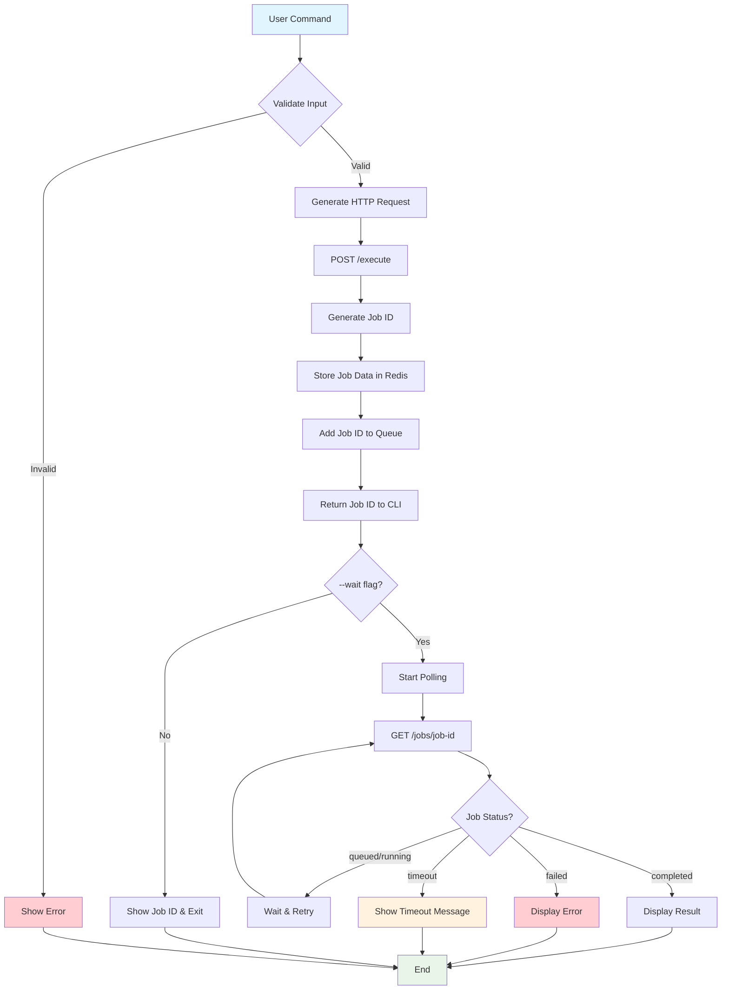

## 🌐 Network Architecture

### Hybrid Deployment Network Diagram

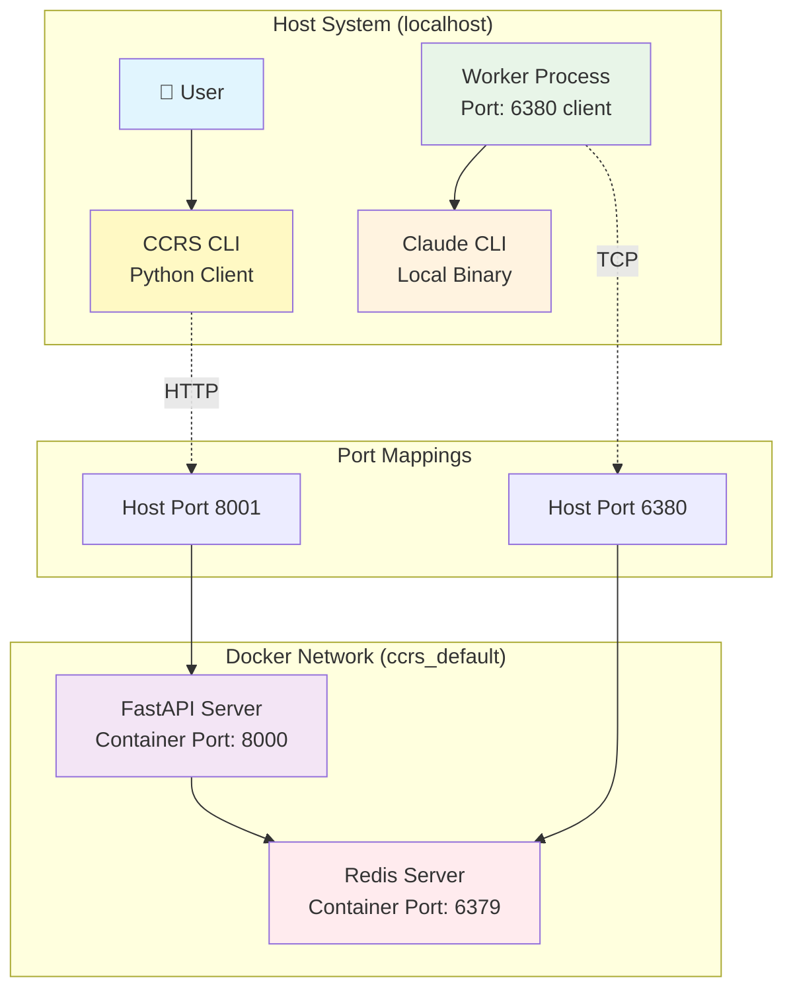

### Network Configuration Details

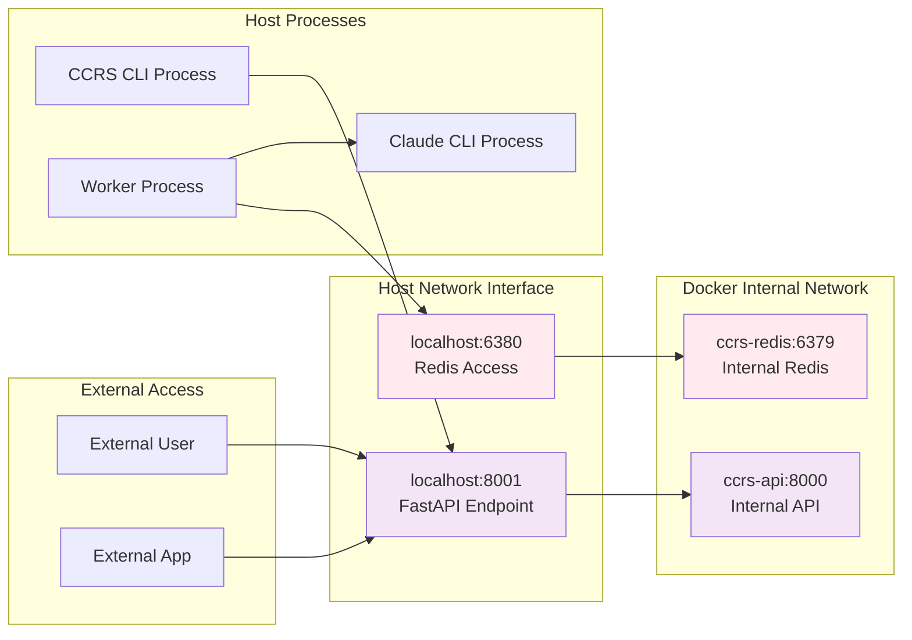

### Container Networking Configuration

```yaml
# docker-compose.hybrid.yml
networks:
  default:
    driver: bridge

services:
  api:
    container_name: ccrs-api
    ports: ["8001:8000"]
    environment:
      REDIS_HOST: redis          # Container-to-container
      REDIS_PORT: 6379          # Internal port
    networks:
      - default

  redis:
    container_name: ccrs-redis
    ports: ["6380:6379"]
    networks:
      - default

# Worker (host) configuration:
# REDIS_HOST=localhost     # Host to container
# REDIS_PORT=6380         # Mapped port
```

### Security Considerations
- **Container Isolation**: API and Redis run in isolated containers
- **Host Access**: Worker has controlled access to host Claude CLI
- **Port Binding**: Only necessary ports exposed to host
- **Network Segmentation**: Containers communicate via internal network

## 🏗️ Technology Stack

### Backend Stack
```yaml
API Server:
  Framework: FastAPI 0.104+
  Language: Python 3.11+
  Validation: Pydantic v1 (for stability)
  Server: Uvicorn ASGI

Queue System:
  Database: Redis 7-alpine
  Client: redis-py
  Pattern: Blocking queue consumer (brpop)

Worker System:
  Runtime: Python 3.11+
  Subprocess: Claude CLI direct execution
  Process Management: PID file tracking
  Logging: File-based in daemon mode
```

### Infrastructure Stack
```yaml
Containerization:
  Engine: Docker 20.10+
  Orchestration: Docker Compose v2
  Base Images: python:3.11-slim, redis:7-alpine

Host Integration:
  CLI Framework: Click 8.0+
  HTTP Client: requests
  Process Management: subprocess, signal handling
```

### Development Stack
```yaml
Testing:
  Framework: pytest
  Mocking: unittest.mock
  Redis: fakeredis (in-memory)
  HTTP Testing: httpx

Code Quality:
  Type Hints: Python typing
  Validation: Pydantic models
  Error Handling: Comprehensive try/except
```

## 🔧 Configuration Architecture

### Environment-Based Configuration

**API Container:**
```bash
REDIS_HOST=redis          # Internal container name
REDIS_PORT=6379          # Internal container port
```

**Worker Process:**
```bash
REDIS_HOST=localhost     # Host Redis access
REDIS_PORT=6380         # Host-mapped Redis port
```

**CLI Client:**
```bash
CCRS_URL=http://localhost:8001  # API endpoint
CCRS_TENANT=demo                # Default tenant
```

### Configuration Hierarchy
1. **Environment Variables** (highest priority)
2. **Command-line flags** (medium priority)
3. **Default values** (lowest priority)

### Multi-Environment Support
```bash
# Development
export CCRS_URL="http://localhost:8001"
export CCRS_TENANT="dev"

# Staging
export CCRS_URL="http://staging-ccrs:8001"
export CCRS_TENANT="staging"

# Production
export CCRS_URL="http://prod-ccrs:8001"
export CCRS_TENANT="production"
```

## 🚀 Deployment Architecture

### Hybrid Deployment Model

**Containers (Infrastructure):**
- **Pros**: Consistent environment, easy scaling, isolated dependencies
- **Cons**: No direct host access, complex volume mounting
- **Used for**: API server, Redis queue

**Host Processes (Integration):**
- **Pros**: Direct CLI access, simple debugging, native performance
- **Cons**: Host dependencies, environment variations
- **Used for**: Worker process, CLI client

### Production Deployment Architecture

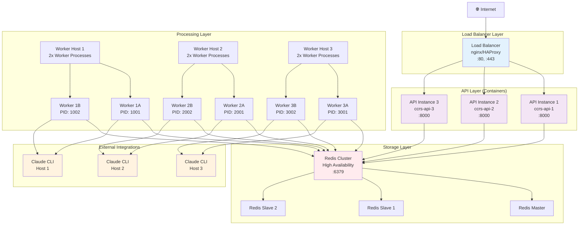

### Scaling Strategy Diagram

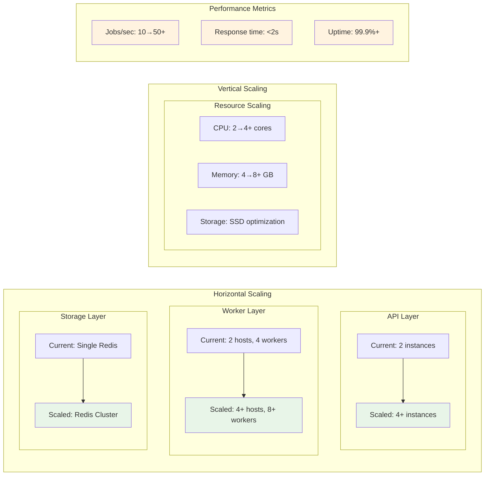

## 📊 Monitoring & Observability

### Monitoring Architecture Overview

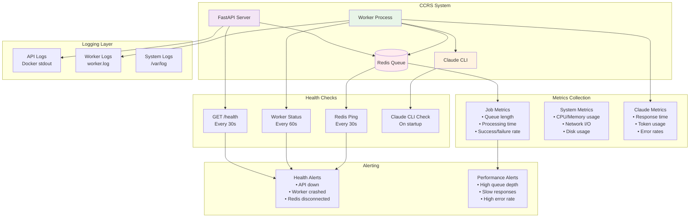

### Health Check Flow Diagram

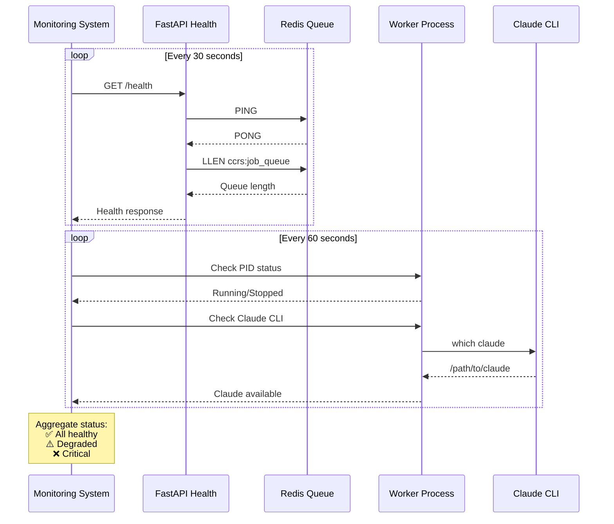

### Logging and Observability Stack

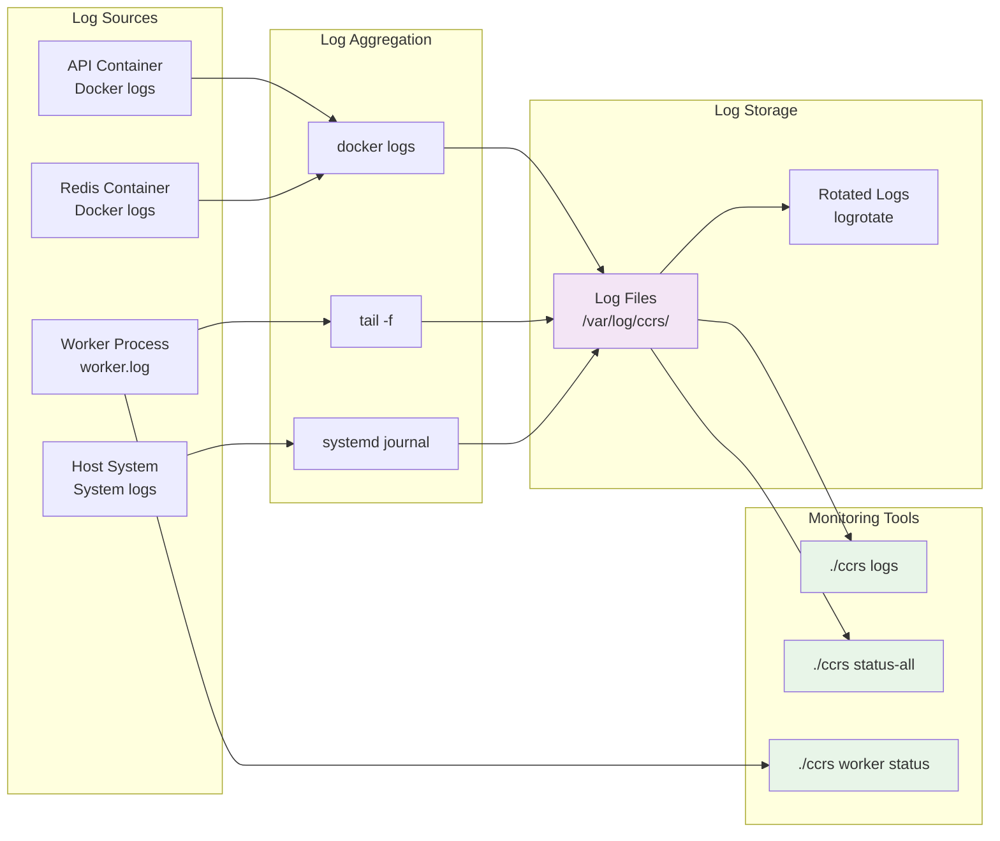

### Health Check Endpoints and Responses

**API Health Endpoint:**
```python
GET /health
Response: {
  "status": "healthy",
  "version": "3.0.0",
  "timestamp": "2026-01-25T20:00:00Z",
  "dependencies": {
    "redis": "connected",
    "queue_size": 5
  }
}
```

**Worker Health Check:**
```bash
./ccrs worker status
# Output:
# ✅ Claude CLI: /Users/user/.local/bin/claude
# ✅ Worker Process: Running (PID: 12345)
# ✅ Redis Connection: OK (port 6380)
```

## 🔒 Security Architecture

### Threat Model & Mitigations

**API Security:**
- **Input Validation**: Pydantic models prevent malicious input
- **Rate Limiting**: Consider implementing in production
- **Authentication**: Add API keys for production use

**Worker Security:**
- **Subprocess Isolation**: Claude CLI runs in controlled subprocess
- **Resource Limits**: Set timeout and memory limits
- **Error Sanitization**: Prevent information leakage in errors

**Network Security:**
- **Container Isolation**: API and Redis isolated from host
- **Port Exposure**: Only necessary ports exposed
- **Internal Communication**: Containers use internal network

### Production Security Checklist

```yaml
API Security:
  □ Add API authentication (API keys/JWT)
  □ Implement rate limiting
  □ Add request size limits
  □ Configure CORS properly
  □ Use HTTPS in production

Worker Security:
  □ Run worker with limited user privileges
  □ Set subprocess timeouts
  □ Sanitize Claude CLI output
  □ Monitor for resource abuse

Infrastructure Security:
  □ Use official base images
  □ Keep containers updated
  □ Use secrets management
  □ Enable Docker content trust
  □ Configure firewall rules
```

## 🔧 Extension Points

### Custom Operations

**Adding New Operations:**
1. Update `models.py` for new request types
2. Add handler in `worker.py`
3. Add CLI command in `cli.py`

Example:
```python
# In worker.py
elif operation == "analyze":
    cmd = ["claude", "--analyze", "--format", "json", message]

# In cli.py
@cli.command()
def analyze(file_path, wait=False):
    # Implementation
```

### Custom Backends

**Claude CLI Alternatives:**
```python
# Worker backend interface
class BackendInterface:
    def execute(self, operation: str, message: str) -> dict:
        pass

class ClaudeCLIBackend(BackendInterface):
    def execute(self, operation, message):
        # Current implementation

class CustomBackend(BackendInterface):
    def execute(self, operation, message):
        # Custom implementation
```

### Monitoring Integration

**Prometheus Metrics:**
```python
# Add to app.py
from prometheus_client import Counter, Histogram

job_counter = Counter('ccrs_jobs_total', 'Total jobs processed')
job_duration = Histogram('ccrs_job_duration_seconds', 'Job processing time')

@app.get("/metrics")
def metrics():
    return Response(generate_latest())
```

---

**This architecture provides a solid foundation for reliable, scalable Claude Code routing with clear separation of concerns and well-defined extension points.**